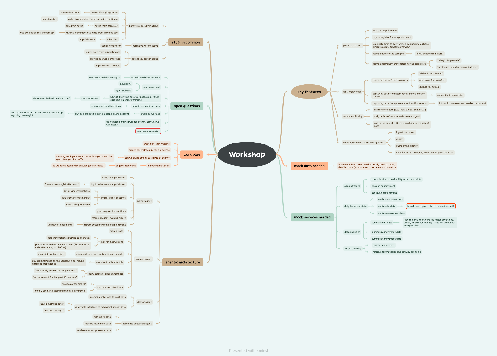
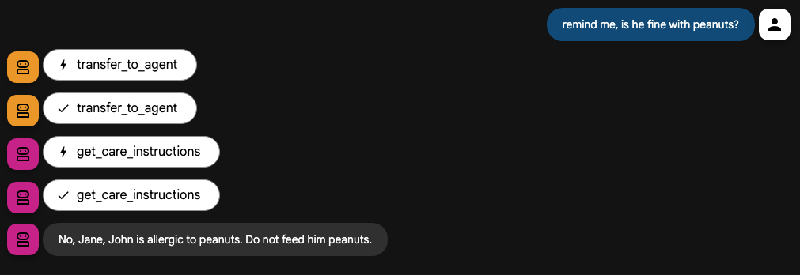
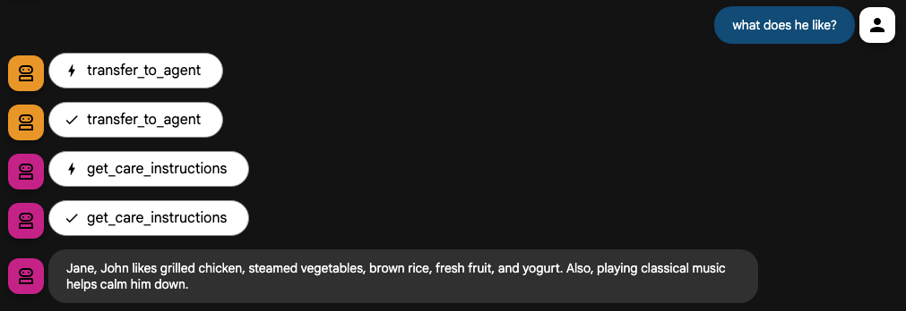
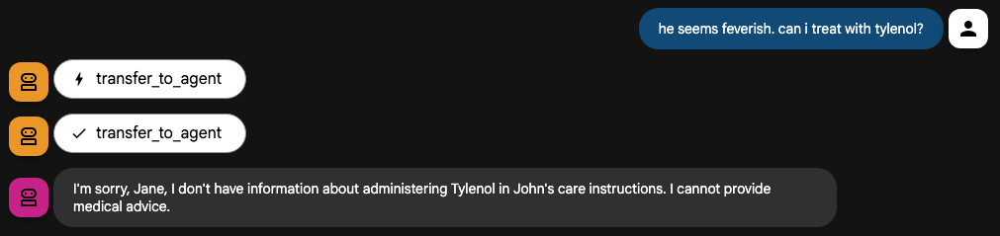
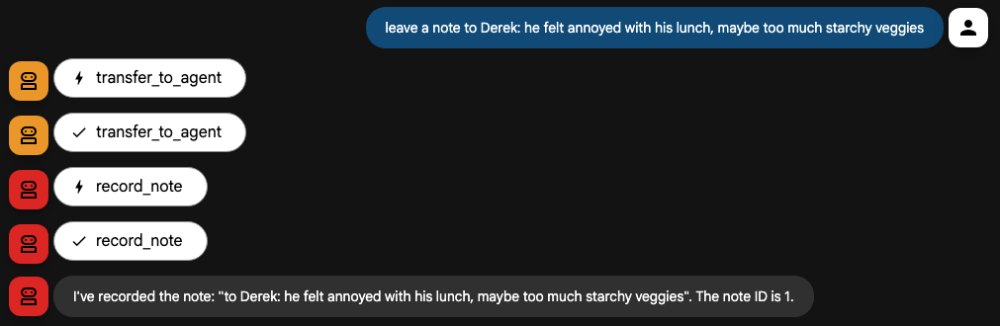
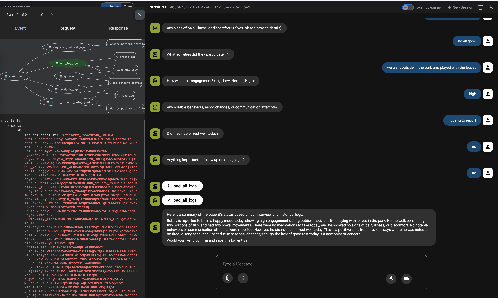
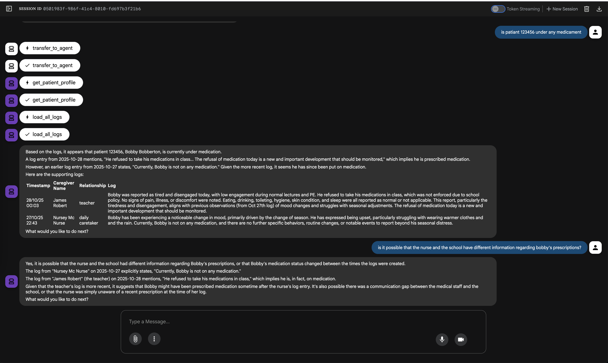

# Rotterdam Table 29 Submission

This repository contains three agents and supporting functions.

Those agents are supporting parents with special-needs children - those that require 24/7 support from medical professionals and doctors.

The three agents support 
(1) the parents - allowing them to more easily communicate with caregivers, record instructions, monitor status and manage their schedules
(2) the caregivers - allowing them to ask about care instructions, pass information about meals, meds, activities from one shift to another, and review notes left by the previous shift
(3) the doctors - by giving them an easy way to review past data, care notes left by the nurses and parents. 

Here is our plan:

## Agents

### 1. Caregiver Agent

The `caregiver/` directory contains an agent that acts as a caregiver. This agent is responsible for logging information about the patient, such as activities, meals, and medications.

Greets the caregiver at the beginning of the shift. Pulls notes from parents and previous shift. Summarizes how was the last shift (slept well? got meds?). 
Pulls data from garmin device monitoring sleep quality. 

The Garmin connection uses a MCP server. The secrets are managed via Google Secrets Manager. 

Of course, this demonstration does not have the full login process implemented - a token is generated from one of our personal devices and will be disposed of after the hackaton. 

Responds to questions about care instructions - grounded in the care instrucructions retrieved at runtime. 

We created an eval to test the grounding. 

Can symthesize information from care instructions, parent notes and other caregiver's observations. 

Is prohibited from guessing and responding to ambiguous questions. If the answer is not explict in the grounding data, it refuses to answer. 

Can capture notes - pertaining meals, meds, activities. 

Can answer questions syntesizing data from previous shift summary, parent notes etc. 

### 2. Parent Agent

The `parent/` directory will contain an agent that acts as a parent. This agent will be able to query the system for information about the patient.

### 3. Doctor and Parent Medical Documentation Agent

The `doctor/` directory will contain an agent that can be used by doctors and parents to access medical documentation.

### 4. Patient Logger Agent

The `patient_logger_agent/` directory contains an agent that is responsible for logging patient information. The agent works by interviewing caregivers with a set of questions to create a daily, highly informative session log. This structured data capture ensures that all critical aspects of the patient's day are recorded.

Practitioners, such as doctors or new caregivers, can then ask questions about the patient in natural language. The agent will analyze the logs and provide detailed answers, making it easy to access relevant information and understand the patient's history and progress.

## Supporting Functions

### Cloud Run Functions

The `cloud_run_functions/` directory contains a Cloud Run function that is responsible for providing a summary of the patient's shift.

This repository also contains supporting functions used by the agents.
